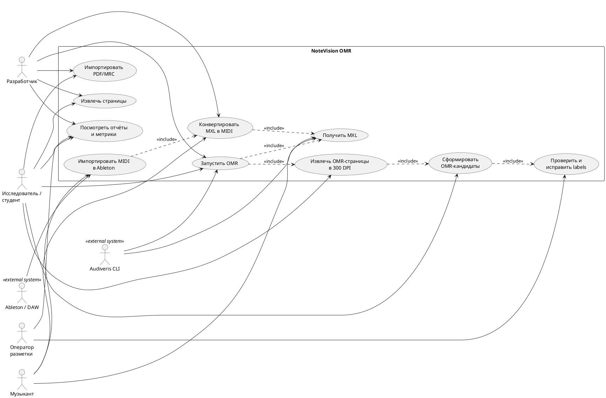
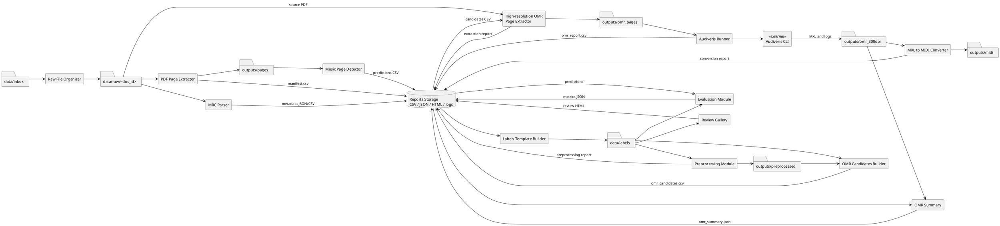
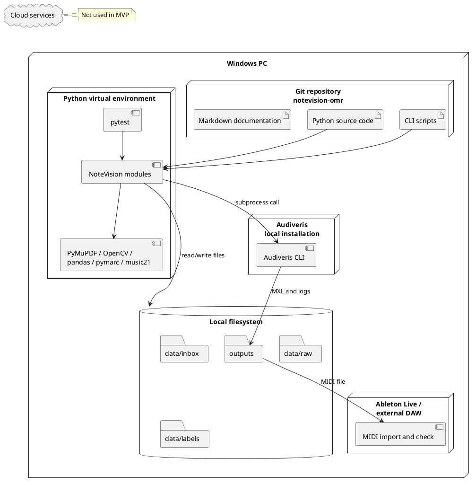

# Задание 4. Архитектура и выбор инструментов

## Проект

**NoteVision OMR — анализ сканированных нотных документов РГБ**

## 1. Цель архитектурного решения

Архитектура NoteVision OMR должна обеспечить воспроизводимую локальную
обработку сканированных нотных документов и связанных библиографических
метаданных:

`PDF/MRC → pages → labels → OMR candidates → 300 DPI OMR pages → Audiveris → MXL → MIDI`

Основные архитектурные цели:

- разделить pipeline на независимые этапы с явными входами и выходами;
- сохранить возможность повторного запуска отдельного этапа без полной
  обработки корпуса;
- изолировать ошибки одного документа или страницы в batch-режиме;
- фиксировать результаты, статусы и сообщения в CSV-, JSON- и log-файлах;
- обеспечить локальную работу с исходниками, которые не публикуются в
  репозитории;
- использовать стандартные форматы PDF, PNG, MRC/MARC, CSV, JSON, MXL и MIDI;
- отделить внутренние Python-модули от CLI-скриптов и внешнего OMR-инструмента;
- оставить возможность последующей замены rule-based detector на обучаемую
  модель без изменения остальных этапов.

Архитектура построена как файловый pipeline. Каждый этап читает
структурированный вход, выполняет одну операцию и сохраняет результат для
следующего этапа:

1. PDF и MRC импортируются из `data/inbox/` в `data/raw/<doc_id>/`.
2. PDF преобразуется в набор PNG-страниц и `manifest.csv`.
3. Детектор рассчитывает признаки страниц и прогнозирует наличие нотной записи.
4. Прогнозы проходят ручную валидацию в CSV и HTML-галерее.
5. Из валидированной разметки формируется список OMR-кандидатов.
6. Выбранные страницы повторно извлекаются из PDF при 300 DPI.
7. Внешний Audiveris создаёт OMR-результаты и экспортирует MXL.
8. `music21` преобразует MXL в MIDI с fallback-режимами для ошибок повторов.
9. Отчёты связывают исходный документ, страницу, статус обработки и выходной
   файл.

В MVP не используется единый сервер приложений или база данных. Связность
между этапами обеспечивается идентификаторами `doc_id`, `page_index`,
согласованной структурой каталогов и табличными manifest/report-файлами. Такой
вариант соответствует небольшому исследовательскому корпусу и упрощает
воспроизведение эксперимента на локальном компьютере.

## 2. Выбор подхода

Для MVP выбран гибридный подход:

- **Classical CV и rule-based признаки** применяются для первичного отбора
  страниц с нотной записью. OpenCV выполняет перевод в grayscale,
  бинаризацию, морфологическое выделение горизонтальных линий и расчёт групп,
  похожих на нотные станы.
- **Audiveris** используется как внешний специализированный OMR-инструмент.
  Проект не реализует собственное распознавание нотных символов, голосов и
  тактов, а передаёт подготовленные страницы готовой системе с экспортом MXL.
- **music21** читает MXL/MusicXML и формирует MIDI. Для некорректно
  распознанных повторов предусмотрены режимы без repeat-объектов и плоский
  fallback.
- **CLI и файловые отчёты** используются вместо web UI. Каждый этап можно
  запускать отдельно, а CSV/JSON позволяют проверять результат стандартными
  средствами.

### 2.1. Сравнение подходов

| Подход | Где применим | Плюсы | Минусы | Решение для MVP |
|---|---|---|---|---|
| Classical CV | Поиск нотных станов, оценка наличия горизонтальных линий, бинаризация и очистка изображения | Не требует обучающей выборки; работает локально; быстро реализуется; признаки и правила интерпретируемы | Чувствителен к артефактам, пустым страницам с линиями, макету и порогам; не распознаёт музыкальную семантику | Используется для baseline-детекции `music / non-music` и предобработки |
| Deep Learning | Классификация страниц, детекция символов, end-to-end OMR | Может лучше учитывать сложные визуальные признаки и разнообразие сканов; допускает дообучение на целевом корпусе | Требует размеченных данных, train/validation/test-разбиения и вычислительных ресурсов; сложнее интерпретировать и воспроизводить на малом корпусе | Не входит в MVP; рассматривается для ВКР после расширения корпуса |
| Hybrid | Последовательность из CV-фильтра, ручной валидации, специализированного OMR и музыкального постпроцессинга | Позволяет быстро получить сквозной результат; сочетает прозрачный отбор страниц с готовым OMR; компоненты можно заменять независимо | Качество зависит от нескольких инструментов; необходим контроль промежуточных форматов; Audiveris остаётся внешней зависимостью | Выбран как основной подход MVP |

### 2.2. Обоснование инструментов

| Инструмент | Роль в архитектуре | Причина выбора | Ограничение |
|---|---|---|---|
| Python | Реализация pipeline и CLI | Единая среда для обработки файлов, изображений, таблиц, метаданных и музыкальных форматов | Необходима установка зависимостей и совместимой версии Python |
| PyMuPDF | Извлечение страниц PDF | Прямой доступ к страницам и рендеринг с заданным DPI | Результат зависит от качества исходного PDF |
| OpenCV | Признаки и предобработка изображений | Морфологические операции, бинаризация и эффективная работа с PNG | Rule-based параметры не гарантируют переносимость на все типы изданий |
| pandas | Manifest, labels и отчёты | Удобное объединение данных по `doc_id` и `page_index`, чтение и запись CSV | CSV не обеспечивает транзакционность и строгую схему |
| pymarc | Разбор MRC/MARC | Специализированная библиотека для MARC-записей | Неполные и нестандартные записи требуют безопасной обработки |
| Audiveris CLI | Распознавание нотной структуры и экспорт MXL | Готовая локальная OMR-система с пакетным запуском и MusicXML-экспортом | Внешняя установка; чувствительность к DPI и качеству скана; технический success не равен музыкальной точности |
| music21 | MXL/MusicXML → MIDI | Поддержка музыкальной структуры и экспорта MIDI из Python | Ошибки в исходном MXL, особенно повторы, требуют fallback-логики |
| pytest | Автоматическая проверка модулей | Изолированные тесты без использования реальных PDF/MRC из корпуса | Тесты не заменяют экспертную проверку качества нот |
| Git и `.gitignore` | Версионирование кода без исходных данных | Репозиторий остаётся компактным и не публикует локальные материалы | Воспроизведение требует отдельного получения исходного корпуса |

### 2.3. Почему в MVP нет web UI

Основной пользователь MVP — исследователь или разработчик, которому важны
контроль параметров, пакетный запуск и возможность проверить промежуточные
файлы. CLI соответствует этим требованиям и не добавляет отдельный слой
развёртывания, авторизации и хранения состояния.

Ручная проверка поддерживается через CSV и статическую HTML-галерею. Web UI
может быть добавлен позднее поверх существующих Python-модулей, если появятся
требования к многопользовательской разметке, очередям заданий и централизованному
хранению результатов.

## 3. Use Case Diagram

Диаграмма отражает роли пользователей и границы NoteVision OMR. Audiveris и
Ableton/DAW показаны как внешние системы: первая выполняет OMR, вторая
используется для технической проверки полученного MIDI.



### 3.1. Интерпретация диаграммы

- **Исследователь / студент** запускает основной pipeline, формирует
  OMR-кандидатов и анализирует отчёты.
- **Оператор разметки** проверяет автоматические прогнозы и исправляет
  `has_music`, `page_type` и комментарии качества.
- **Музыкант** проверяет MXL и MIDI в музыкальном программном обеспечении.
- **Разработчик** поддерживает модули, CLI, обработку ошибок и тесты.
- **Audiveris** вызывается локально как внешний исполняемый файл и возвращает
  MXL либо диагностическую ошибку.
- **Ableton / DAW** находится за границей системы и служит внешней точкой
  проверки импорта MIDI.

Диаграмма показывает логическую последовательность сценариев, но не означает,
что все операции выполняются одним процессом. В текущей архитектуре каждый
этап запускается отдельной CLI-командой и обменивается данными через файловую
структуру проекта.

## 4. Component Diagram

Компонентная архитектура разделяет работу с исходными файлами, изображениями,
разметкой, OMR и итоговыми музыкальными форматами. CLI-скрипты являются тонким
слоем запуска, а основная логика размещена в модулях `src/notevision/`.

Основные компоненты:

- **Raw File Organizer** группирует PDF и MRC по `doc_id`;
- **PDF Page Extractor** формирует PNG-страницы и manifest;
- **MRC Parser** извлекает библиографические метаданные;
- **Music Page Detector** рассчитывает CV-признаки и прогнозы;
- **Labels Template Builder** подготавливает CSV для разметки;
- **Review Gallery** создаёт локальную HTML-галерею;
- **Evaluation Module** рассчитывает метрики классификации;
- **Preprocessing Module** нормализует и бинаризует нотные страницы;
- **OMR Candidates Builder** выбирает страницы для распознавания;
- **High-resolution OMR Page Extractor** повторно извлекает кандидатов при
  300 DPI;
- **Audiveris Runner** вызывает внешний Audiveris CLI;
- **OMR Summary** агрегирует статусы и найденные MXL;
- **MXL to MIDI Converter** преобразует MXL в MIDI;
- **Reports Storage** хранит CSV-, JSON-, HTML-отчёты и логи.



Компоненты взаимодействуют через файлы, поэтому сбой Audiveris или
конвертации MIDI не требует повторного импорта и извлечения страниц.
Промежуточные результаты можно проверять и пересоздавать независимо.

## 5. Deployment Diagram

MVP развёртывается локально на Windows PC. Код находится в Git-репозитории,
Python-зависимости устанавливаются в виртуальное окружение, а исходные и
производные данные сохраняются в локальной файловой системе. Audiveris
устанавливается отдельно и вызывается как исполняемый файл. Ableton Live или
другая DAW используется за границей NoteVision OMR для проверки MIDI.

Облачные вычисления, сервер приложений, REST API и удалённое хранилище в MVP
отсутствуют.



## 6. Pipeline

Последовательность каталогов и основных артефактов:

```text
data/inbox
    ↓ organize_raw_files.py
data/raw
    ↓ extract_pages.py / batch_run_pipeline.py
outputs/pages
    ↓ run_pipeline.py
outputs/predictions
    ↓ build_labels_template.py + manual review
data/labels/pages_validated.csv
    ↓ preprocess_music_pages.py
outputs/preprocessed
    ↓ build_omr_candidates.py
outputs/reports/omr_candidates.csv
    ↓ extract_omr_pages.py
outputs/omr_pages
    ↓ run_audiveris_omr.py
outputs/omr_300dpi
    ↓ convert_mxl_to_midi.py
outputs/midi
    ↓ manual import
Ableton Live / DAW
```

MRC обрабатывается параллельной ветвью:

```text
data/raw/<doc_id>/*.mrc
    ↓ parse_mrc.py / parse_mrc_batch.py
outputs/reports/*_metadata.json
outputs/reports/all_metadata.csv
```

Оценка детектора и технических результатов OMR также выполняется отдельными
ветвями отчётности и не изменяет исходные данные.

## 7. Выбор инструментов

| Инструмент | Роль в проекте | Причина выбора | Альтернативы |
|---|---|---|---|
| Python | Основной язык модулей и CLI | Поддерживает обработку PDF, изображений, таблиц, MARC и музыкальных форматов в одной среде | Java, C#, Julia |
| PyMuPDF | Рендеринг страниц PDF в PNG при заданном DPI | Простой API, быстрый локальный рендеринг, доступ к размерам страниц | pdf2image + Poppler, pypdfium2 |
| pandas | Работа с manifest, labels, predictions и reports | Удобные CSV-операции, фильтрация, группировка и merge по ключам | Polars, стандартный модуль `csv`, SQLite |
| OpenCV | Бинаризация, морфология и извлечение признаков | Эффективные classical CV-операции и зрелая экосистема | scikit-image, Pillow |
| pymarc | Чтение MRC/MARC-записей | Специализированный Python API для библиотечных метаданных | marc4j, ручной MARC-парсер |
| pytest | Модульные и интеграционные тесты | Простые fixtures, временные каталоги и проверка исключений | unittest, nose2 |
| Audiveris | OMR печатной нотной записи и экспорт MXL | Готовый локальный CLI и поддержка MusicXML | Oemer, коммерческие OMR-системы, собственная модель |
| music21 | Разбор MXL/MusicXML и экспорт MIDI | Музыкальная объектная модель и поддержка fallback-преобразований | MuseScore CLI, pretty_midi, mido |
| Ableton Live | Внешняя проверка импорта и воспроизведения MIDI | Практическая проверка совместимости результата с DAW | MuseScore, REAPER, Logic Pro, FL Studio |
| Git/GitHub | Версионирование кода и документации | История изменений, удалённый репозиторий и воспроизводимая поставка кода | GitLab, Bitbucket |
| Markdown | README и документы проектного семинара | Текстовый формат, удобный для Git и последующего рендеринга диаграмм | AsciiDoc, reStructuredText, DOCX |

Выбор инструментов ориентирован на локальный исследовательский MVP. Он не
фиксирует окончательный технологический стек для промышленной системы.

## 8. Интерфейсы между компонентами

Вход и выход каждого этапа представлены файлами. CSV и JSON выполняют роль
явных контрактов между модулями, а CLI-команды — роль интерфейса запуска.
Бинарные форматы PDF, PNG, MXL и MIDI передаются без встраивания в базу данных.
REST API в MVP отсутствует.

| Компонент | Вход | Выход | Контракт |
|---|---|---|---|
| Raw File Organizer | `data/inbox/*.pdf`, `*.mrc` | `data/raw/<doc_id>/`, `source.txt`, import report | `doc_id` определяется из имени; исходное имя файла сохраняется |
| PDF Page Extractor | PDF, `doc_id`, DPI | `page_XXX.png`, `manifest.csv` | Manifest: `doc_id`, `page_index`, `image_path`, `width`, `height`, `dpi` |
| MRC Parser | Один MRC или каталог документа | Metadata JSON/CSV | Поля отсутствующей MARC-записи допускают `null` или пустой список |
| Music Page Detector | `manifest.csv`, PNG | Predictions CSV | Ключ: `doc_id + page_index`; прогноз: `has_music_pred`, `has_music_score` |
| Labels Template Builder | Predictions CSV | `pages_template.csv` | Добавляются `page_type`, `has_music`, `quality_comment` |
| Review Gallery | Labels CSV и локальные PNG | HTML | Изображения подключаются относительными путями |
| Evaluation Module | Labels CSV и predictions CSV | Metrics JSON | Ground truth: `has_music`; prediction: `has_music_pred`; merge по составному ключу |
| Preprocessing Module | Labels с `has_music == 1`, PNG | `page_XXX_binary.png`, report CSV | Каждая строка отчёта содержит status и message |
| OMR Candidates Builder | Валидированные labels | `omr_candidates.csv` | Отбор: `has_music == 1` и `page_type == "music"` |
| High-resolution OMR Page Extractor | Candidates CSV и исходный PDF | PNG 300 DPI, report CSV | Извлекаются только указанные `page_index`; основной `outputs/pages` не изменяется |
| Audiveris Runner | PNG и путь к Audiveris | MXL, логи, `omr_report.csv` | Один каталог результата на `doc_id/page_XXX`; ошибка страницы не останавливает batch |
| OMR Summary | OMR report и каталог результатов | `omr_summary.json` | Сводка total/success/failed, MXL paths и размеры файлов |
| MXL to MIDI Converter | Один MXL или каталог MXL | MIDI и conversion report | Режимы `normal`, `no_repeats`, `flat_fallback` |
| Reports Storage | Статусы и результаты всех этапов | CSV, JSON, HTML, logs | UTF-8; пути и идентификаторы связывают отчёт с документом и страницей |

Файловые контракты упрощают аудит, но требуют контроля схемы. При росте
проекта их целесообразно формализовать через модели данных и версирование схем.

## 9. Обоснование архитектуры

### 9.1. Почему локальный pipeline

Исходные документы хранятся локально, а корпус MVP имеет небольшой объём.
Локальный pipeline исключает передачу PDF/MRC сторонним сервисам, упрощает
работу с Audiveris и позволяет исследователю видеть каждый промежуточный
артефакт.

### 9.2. Почему не cloud

Cloud-развёртывание потребовало бы хранилища, управления доступом, очереди
задач, мониторинга расходов и отдельной проверки прав на загрузку документов.
Для проверки исследовательской гипотезы это не даёт достаточного выигрыша.
Cloud может быть рассмотрен после формализации правового режима и требований к
масштабированию.

### 9.3. Почему не web UI

CLI покрывает пакетные сценарии и позволяет явно задавать пути и параметры.
Для ручной проверки достаточно CSV и статической HTML-галереи. Web UI станет
оправданным при многопользовательской разметке, централизованном хранении и
необходимости скрыть технические детали запуска.

### 9.4. Почему Audiveris вместо собственной OMR-модели

Разработка собственной OMR-модели требует разметки нотных символов и структуры,
обучающей инфраструктуры и отдельной оценки музыкальной точности. Audiveris
позволяет получить MXL в рамках семестрового MVP и сосредоточиться на
подготовке данных, интеграции и анализе ошибок. Внешний инструмент не
исключает будущую замену или сравнение с собственной моделью.

### 9.5. Почему 200 DPI и 300 DPI

Разрешение 200 DPI используется для быстрого извлечения всех страниц,
вычисления признаков и ручной проверки. Оно уменьшает размер файлов и время
baseline-обработки. Audiveris оказался чувствителен к размеру `interline`,
поэтому только отобранные OMR-кандидаты повторно извлекаются при 300 DPI.
Такой двухступенчатый процесс не увеличивает стоимость обработки всего корпуса.

### 9.6. Почему outputs не коммитятся

`outputs` содержит большие и воспроизводимые производные файлы: PNG, MXL,
MIDI, логи и отчёты экспериментов. Их хранение в Git увеличивало бы размер
репозитория и могло бы привести к публикации производных материалов без
правовой проверки. В репозитории сохраняется структура каталогов через
`.gitkeep`, а результаты создаются локальными CLI-командами.

## 10. Этические и правовые меры в архитектуре

- Исходные PDF и MRC исключены из Git через `.gitignore`.
- Производные каталоги `outputs` также не коммитятся.
- Обработка выполняется локально без отправки документов в cloud API.
- Проект не обрабатывает персональные данные.
- Публичный репозиторий содержит код, тесты и документацию, но не библиотечный
  корпус.
- Правовой режим материалов РГБ необходимо проверять до масштабного
  скачивания, обработки или публикации.
- Производные MXL и MIDI не должны публиковаться без отдельной проверки прав на
  произведение, издание и цифровую копию.

Эти меры снижают риск случайной публикации данных, но не заменяют юридическую
экспертизу.

## 11. Текущие результаты, подтверждающие архитектуру

| Показатель | Фактический результат |
|---|---:|
| Автоматические тесты | 51 passed |
| Обработанные документы | 6 |
| Извлечённые и размеченные страницы | 434 |
| OMR-кандидаты после ручной корректировки | 392 |
| Accuracy music-page detector | 0.9816 |
| Precision music-page detector | 0.9800 |
| Recall music-page detector | 1.0000 |
| F1 music-page detector | 0.9899 |
| OMR при 300 DPI на 50 кандидатах | 50 success / 0 failed |
| MXL→MIDI batch | 10 success / 0 failed |
| Проверка в Ableton | Один MIDI успешно импортирован |

Результаты подтверждают техническую работоспособность модульного pipeline на
текущем корпусе. Метрики детектора рассчитаны по валидированной разметке, а
успех OMR и MIDI означает завершение обработки без технической ошибки. Эти
показатели не являются полной экспертной оценкой музыкальной точности MXL и
MIDI.

## 12. Ограничения архитектуры

- Нет web UI и многопользовательского режима разметки.
- Нет REST API и программного сетевого интерфейса.
- Audiveris является внешним инструментом с отдельной установкой и
  зависимостью от версии.
- Технический `success` и наличие MXL не гарантируют правильность нот,
  длительностей, голосов, тактов и повторов.
- Корпус из 6 документов мал и может быть нерепрезентативен для фонда РГБ.
- В MVP нет собственной нейросетевой модели классификации или OMR.
- CSV-контракты не имеют строгого централизованного версирования схем.
- Локальная архитектура ограничивает параллельную обработку и совместную
  работу нескольких операторов.

Ограничения соответствуют масштабу проектного семинара и должны быть
пересмотрены при переходе к ВКР или промышленному прототипу.

## 13. Вывод

Выбранная архитектура соответствует задачам MVP проектного семинара. Она
воспроизводима, модульна, работает локально и предоставляет проверяемые
промежуточные результаты через файловые контракты, отчёты и автоматические
тесты. Гибридный подход позволяет использовать прозрачный classical CV для
отбора страниц, готовый Audiveris для OMR и `music21` для экспорта MIDI.

Для ВКР архитектуру можно расширить web-интерфейсом, API, индексом
библиографических и музыкальных данных, поиском, document-level ML-моделями и
формализованной экспертной оценкой качества OMR. Такое развитие может быть
выполнено без полной замены текущего pipeline, поскольку его этапы и форматы
разделены.
