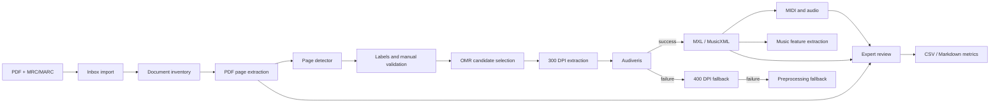

# Архитектура MVP NoteVision OMR

## 1. Цель MVP

Цель MVP:

> Разработать web-интерфейс и воспроизводимый pipeline для обработки
> сканированных нотных документов библиотеки: импорт PDF/MRC, извлечение
> страниц, определение нотных страниц, запуск OMR, генерация MXL/MIDI,
> извлечение музыкально-теоретических характеристик и экспертная проверка
> результата.

MVP объединяет исследовательский pipeline и минимальный пользовательский
контур. Pipeline отвечает за воспроизводимую пакетную обработку файлов,
формирование артефактов и отчётов. Web-интерфейс предназначен для контроля
результатов человеком: просмотра страниц, оценки OMR, разбора failures и
скачивания MXL/MIDI.

Текущая реализация не является промышленной библиотечной системой. Она
подтверждает техническую проходимость процесса, фиксирует файловые контракты
между этапами и создаёт основу для последующего document dashboard, очереди
задач и централизованного хранения статусов.

Текущее состояние корпуса:

- 52 документа в inventory;
- 51 документ с PDF;
- 2513 страниц в доступных PDF;
- один документ с отсутствующим PDF, который учитывается как неполный и не
  считается ошибкой page pipeline.

## 2. Роли пользователей

| Роль | Ответственность | Основные действия |
|---|---|---|
| Оператор библиотеки | Подготовка и контроль документов | Загружает PDF/MRC, проверяет импорт, исправляет типы страниц, отслеживает failures |
| Эксперт-музыкант | Содержательная оценка OMR | Сравнивает скан и результат, слушает аудио/MIDI, оценивает пригодность, фиксирует музыкальные ошибки |
| Разработчик/администратор | Эксплуатация pipeline | Запускает batch-команды, управляет конфигурацией, анализирует логи, выполняет fallback, формирует отчёты |

В текущем MVP операторские операции выполняются преимущественно через CLI и
CSV/HTML-артефакты. `review_app` реализует web-контур для эксперта-музыканта и
частично для разработчика, который разбирает OMR failures.

## 3. Основные пользовательские сценарии

### 3.1. Импорт и анализ документа

1. Оператор помещает PDF и MRC/MARC в `data/inbox`.
2. `organize_raw_files.py` связывает файлы по `doc_id` и переносит их в
   `data/raw/<doc_id>/`.
3. `build_document_inventory.py` формирует реестр документов и статусы
   наличия PDF/MRC.
4. `run_corpus_analysis.py` запускает последовательность безопасных этапов:
   извлечение страниц, detector, labels template и отчёты.
5. Ошибка одного документа фиксируется в run log и не должна останавливать
   весь корпус, если не указан режим `fail-fast`.

### 3.2. Просмотр документа и его страниц

Целевой document dashboard должен показывать:

- библиографические сведения из MRC/MARC;
- число страниц и прогресс обработки;
- thumbnails страниц;
- `page_type`: `music`, `mixed`, `title`, `text`, `blank`, `unknown`,
  `bad_scan`;
- бинарный признак `has_music`;
- confidence detector;
- статус OMR и доступные артефакты;
- причины failures и результаты fallback.

Базовый document dashboard уже реализован в `review_app`: он объединяет
inventory, labels, OMR/fallback-отчёты и доступные артефакты. Для каждой страницы
есть отдельный защищённый экран со сканом, статусами, ссылками на MXL/MIDI,
audio preview, музыкальными характеристиками и переходом к экспертной проверке.
Дальнейшее развитие требуется для очередей обработки, редактирования данных и
масштабирования dashboard на промышленный контур.

### 3.3. Запуск и проверка OMR

1. В OMR включаются страницы с `has_music = 1` и типом `music` или `mixed`.
2. Страница повторно извлекается из PDF в 300 DPI.
3. Audiveris формирует MXL/MusicXML.
4. `music21` конвертирует MXL в MIDI.
5. При основном failure возможен отдельный эксперимент в 400 DPI.
6. Для оставшихся failures применяются варианты crop, deskew, CLAHE и
   adaptive threshold.
7. Primary, 400 DPI fallback и preprocessing fallback сохраняются раздельно,
   поэтому основной показатель не смешивается с recovery experiments.

### 3.4. Экспертная проверка

Эксперт открывает защищённый `review_app` и:

- просматривает исходный скан;
- прослушивает общее MP3 и отдельные дорожки;
- скачивает MIDI и MXL/MusicXML, если файлы существуют;
- выбирает `page_usable`: `yes`, `partial` или `no`;
- задаёт `usability_score`;
- отмечает pitch, rhythm, missing/extra notes, chord, voice, measure
  structure и playback problems;
- сохраняет draft или завершает проверку.

Результаты разных экспертов хранятся независимо. Экспорт и расчёт метрик
поддерживают воспроизводимое исключение локальных, тестовых или признанных
некорректными reviewer без удаления их записей из SQLite.

### 3.5. Музыкально-теоретические характеристики

Целевой MVP должен извлекать из MXL/MusicXML признаки двух уровней.

Обязательные признаки:

- тональность;
- размер;
- ключи.

Желательные признаки:

- инструментальный состав;
- число партий;
- темп;
- диапазон;
- плотность нотных событий.

Этот модуль ещё не завершён. Предполагаемый источник данных — MXL/MusicXML,
а базовый инструмент разбора — `music21`. Признаки должны сохраняться в
структурированном CSV/JSON и связываться с `doc_id`, страницей и версией OMR.
Для каждого значения необходимо сохранять:

- `source`: `musicxml`, `heuristic`, `manual` или `not_found`;
- `confidence`: `high`, `medium` или `low`.

Если признак отсутствует или не может быть определён надёжно, система не
должна выдумывать значение. В интерфейсе и отчёте указывается `unknown`, а
`source` принимает значение `not_found`.

## 4. Pipeline

```text
PDF/MRC
→ import inbox
→ document inventory
→ page extraction
→ page classifier / has_music detector
→ OMR candidate selection
→ Audiveris OMR
→ MXL/MusicXML
→ MIDI/audio
→ music feature extraction
→ expert review
→ reports/metrics
```



### 4.1. Контракты между этапами

| Этап | Вход | Выход |
|---|---|---|
| Import | PDF, MRC/MARC | `data/raw/<doc_id>/`, import report |
| Inventory | `data/raw` | `document_inventory.csv` |
| Page extraction | PDF | PNG и `manifest.csv` |
| Detector | PNG/manifest | page predictions CSV |
| Validation | predictions | validated labels CSV |
| OMR candidates | validated labels | candidates/evaluation sample CSV |
| Audiveris | 300 DPI PNG | MXL, логи, OMR report |
| MIDI conversion | MXL | MIDI и conversion report |
| Expert review | scan, audio, MXL/MIDI | SQLite reviews и CSV export |
| Metrics | review export | metrics CSV и Markdown summary |

CSV/JSON являются исследовательскими контрактами MVP. При переходе к
многопользовательскому продукту операционные статусы следует перенести в БД,
оставив CSV как формат экспорта и воспроизводимого анализа.

## 5. Статусы обработки

### 5.1. Статус документа

| `document_status` | Значение |
|---|---|
| `new` | Документ обнаружен во входящей папке, импорт ещё не выполнен |
| `imported` | PDF/MRC организованы по `doc_id`, создана запись inventory |
| `pages_extracted` | Страницы PDF извлечены, manifest сформирован |
| `analyzed` | Detector и первичная классификация страниц завершены |
| `omr_ready` | Сформирован набор подтверждённых OMR-кандидатов |
| `omr_done` | Для всех выбранных страниц завершён основной OMR |
| `has_failures` | Есть страницы с ошибкой OMR или конвертации |
| `reviewed` | Необходимая операторская/экспертная проверка завершена |

Статус документа должен вычисляться из состояния страниц, но при этом
хранить дату обновления, версию pipeline и краткую причину неполной обработки.

### 5.2. Статус страницы

| `page_status` | Значение |
|---|---|
| `extracted` | PNG создан из PDF |
| `classified` | Получены `page_type`, `has_music` и prediction |
| `omr_skipped` | Страница осознанно исключена из OMR |
| `omr_success` | Основной запуск создал MXL |
| `omr_failed` | Основной запуск не создал корректный MXL |
| `fallback_recovered` | MXL/MIDI получены через 400 DPI или preprocessing fallback |
| `expert_reviewed` | Экспертная оценка страницы завершена |

Дополнительно полезно хранить `attempt`, `processing_version`,
`failure_reason`, `runtime_seconds`, `artifact_path` и `updated_at`.

## 6. Что уже реализовано

### 6.1. Корпус и detector

- импорт и организация PDF/MRC;
- MRC/MARC parsing;
- `build_document_inventory.py`;
- извлечение PDF-страниц в PNG;
- rule-based OpenCV detector нотных страниц;
- шаблоны labels и ручная валидация;
- отчёты по качеству корпуса, ошибкам detector и dataset statistics;
- `scripts/run_corpus_analysis.py` для согласованного запуска этапов корпуса.

### 6.2. OMR и fallback

- формирование OMR candidates и evaluation sample;
- извлечение выбранных страниц в 300 DPI;
- запуск Audiveris с `skip-existing` и resume;
- конвертация MXL в MIDI через `music21`;
- основной OMR report и failure report;
- 400 DPI fallback как отдельный эксперимент;
- preprocessing fallback с несколькими вариантами подготовки изображения;
- раздельное хранение primary и fallback-результатов.

### 6.3. Экспертный web-контур

- защищённый `review_app` на FastAPI/Jinja2/SQLite;
- read-only dashboard `/documents`, `/documents/<doc_id>` и отдельная страница
  `/documents/<doc_id>/pages/<page_index>`;
- защищённые ссылки на PNG, MXL, MIDI, audio preview и отдельные tracks без
  раскрытия абсолютных локальных путей;
- независимые отзывы нескольких экспертов;
- draft/completed workflow;
- просмотр скана, общего audio и отдельных tracks;
- скачивание MIDI и MXL/MusicXML через защищённые routes;
- failure review для разбора логов и причин OMR-сбоев;
- `review_app.export_csv`;
- `scripts/review_progress.py`;
- `scripts/calculate_expert_review_metrics.py`;
- фильтрация reviewer при экспорте и анализе без удаления исходных оценок.

## 7. Что нужно добавить

| Компонент | Назначение | Приоритет |
|---|---|---|
| Document dashboard | Единый экран документа, метаданных, страниц, статусов и артефактов | Высокий |
| Inbox dashboard | Загрузка PDF/MRC, проверка matching и запуск импорта | Средний |
| Music feature extraction | Тональность, размер, ключи, состав, партии и другие признаки из MusicXML | Высокий |
| Page classifier training | Обучаемый baseline и сравнение с rule-based detector | Высокий для исследовательской части |
| OMR sample 300 | Более крупная и стратифицированная выборка для оценки устойчивости | Высокий |
| Failure dashboard | Общая статистика причин, retries и fallback recovery | Средний; базовый review уже есть |
| Expert review sets | Назначение разных наборов страниц разным экспертам | Средний |
| Research justification | Обзор методов, дизайн эксперимента, доверительные интервалы и границы обобщения | Высокий |

Для dashboard потребуется единая модель `Document`, `Page`,
`ProcessingRun`, `Artifact`, `Failure` и `ExpertReview`. Тяжёлые операции
Audiveris не должны выполняться внутри HTTP-запроса: web-приложение должно
создавать задачу, а worker — выполнять её асинхронно.

### 7.1. Research extension: обучаемый page classifier

В исследовательское расширение MVP добавлены два обучаемых baseline:

- classical ML: Logistic Regression и Random Forest на интерпретируемых
  визуальных признаках страницы;
- CNN: MobileNetV3 Small с transfer learning при доступности pretrained weights.

Ground truth для обучения и оценки ограничен источниками `manual_previous` и
`manual_thesis`. Автоматические `template_prediction` исключаются. Разбиение
выполняется по `doc_id`, чтобы страницы одного документа не попадали
одновременно в train и validation. Это позволяет сравнивать ML classifier с
rule-based detector на одной ручной validation-выборке и снижает риск утечки
особенностей конкретного издания.

Для CNN применяются только консервативные аугментации: поворот до 3 градусов,
brightness/contrast jitter, лёгкий blur и resize/crop. Flip и агрессивные
perspective transformations исключены, поскольку могут нарушать физическую
структуру нотной страницы. Обучаемый classifier не заменяет OMR: он уменьшает
число ложных запусков Audiveris на `title`, `text` и `blank` страницах.

## 8. Ограничения MVP

- Собственная OMR-модель с нуля не обучается.
- Audiveris используется как воспроизводимый baseline OMR engine.
- Текущий detector страниц основан на rule-based CV-признаках; его высокая
  метрика на текущем корпусе не доказывает переносимость на весь фонд.
- Полный MusicXML ground truth отсутствует.
- Экспертная проверка необходима для оценки музыкальной пригодности.
- Technical success создания MXL/MIDI не равен musical correctness.
- Наличие файла не подтверждает корректность высоты нот, длительностей,
  тактов, голосов, аккордов и повторов.
- Часть labels получена из template prediction, поэтому метрики должны
  отдельно анализироваться по `validation_source`.
- Audiveris является внешним CPU-bound инструментом.
- Текущий файловый pipeline не заменяет очередь задач, транзакционную БД,
  аудит версий и промышленный мониторинг.
- Корпус из 52 документов полезен для MVP и ВКР-экспериментов, но недостаточен
  для утверждения о качестве на всём библиотечном фонде.

## 9. Ответы на вопросы преподавателя

### 9.1. Обучаем ли мы модель?

В текущем основном pipeline собственная модель не обучается. Detector
музыкальных страниц использует интерпретируемые признаки OpenCV:
бинаризацию, долю чёрных пикселей, горизонтальные линии, их плотность и
staff-like groups. Решение о `has_music` принимается rule-based алгоритмом.

Для ВКР целесообразно обучить page-level baseline на ручной разметке и
сравнить его с текущим detector. Объектом обучения должен быть классификатор
страниц, а не full OMR. Минимальное сравнение может включать логистическую
регрессию или tree-based модель на инженерных признаках; более сложный
вариант — transfer learning для изображений страниц. Split должен быть
document-level, чтобы страницы одного документа не попадали одновременно в
train и test.

### 9.2. Почему не обучаем OMR с нуля?

Full OMR требует разметки символов, нот, длительностей, тактов, связей,
голосов и структуры партитуры. В текущем корпусе нет достаточного
symbol-level/measure-level ground truth. Разметка такого набора дорога и
требует музыкальной экспертизы.

Audiveris позволяет получить воспроизводимый baseline и сначала измерить,
какие классы исторических страниц действительно требуют нового метода.
Обучение собственной OMR-модели оправдано только после benchmark
существующих решений, категоризации ошибок и формирования эталонной выборки.

### 9.3. Где аугментации?

В текущем rule-based detector обучающей выборки нет, поэтому аугментации как
часть training loop не используются. Для будущего обучаемого page classifier
релевантны:

- небольшие повороты и perspective distortion;
- blur и шум сканирования;
- изменения контраста и яркости;
- crop и имитация обрезки;
- bleed-through/ghosting;
- масштабирование и изменение разрешения.

Аугментации должны имитировать реальные дефекты фонда. Вертикальные и
нефизичные преобразования использовать нельзя. Preprocessing fallback
`crop/deskew/CLAHE/adaptive threshold` является экспериментом восстановления
OMR, а не аугментацией обучающей выборки.

### 9.4. Какую модель используем?

На уровне page detection используется rule-based CV baseline. На уровне
распознавания нот используется Audiveris. Для разбора MusicXML и конвертации
в MIDI используется `music21`.

Таким образом, архитектура гибридная:

```text
classical CV detector
+ external OMR engine
+ deterministic MusicXML processing
+ human expert review
```

Обучаемая page-level модель должна быть добавлена как сравниваемый
эксперимент, а не объявляться уже реализованной частью MVP.

### 9.5. Что из магистратуры применено?

В проекте применены:

- постановка задачи и декомпозиция ML/CV pipeline;
- подготовка корпуса, data contracts и контроль качества данных;
- бинарная классификация и confusion matrix;
- accuracy, precision, recall и F1;
- анализ смещения метрик из-за источника labels;
- document-level подход к будущему train/test split;
- computer vision preprocessing;
- проектирование воспроизводимых экспериментов;
- batch processing, resume, skip-existing и анализ производительности;
- human-in-the-loop и экспертная оценка;
- web/API архитектура, роли, безопасность и аудит результатов;
- разделение технической успешности и содержательного качества.

Исследовательская часть ВКР должна дополнить инженерную реализацию
сравнительным экспериментом, обоснованием выборки и оценкой музыкальной
корректности.

### 9.6. Как понимаем, что документов достаточно?

Для демонстрации MVP текущий inventory содержит 52 документа: 51 документ с
PDF и один документ без PDF. Для 51 доступного PDF учтено 2513 страниц. Этот
объём достаточен для проверки прикладного MVP: он позволяет пройти полный
pipeline, выявить разные типы страниц, измерить detector и сформировать
OMR/экспертную выборку.

Однако 52 документа и 2513 страниц недостаточны для автоматического вывода о
качестве на всём библиотечном фонде.

Для вывода о всём фонде число документов нельзя считать достаточным только по
абсолютному объёму. Достаточность должна подтверждаться:

- покрытием разных годов, издательств, типов печати и качества сканов;
- наличием печатных, рукописных, mixed, photo и degraded страниц;
- document-level независимостью evaluation;
- стабилизацией метрик при добавлении новых документов;
- доверительными интервалами;
- достаточным числом positive и negative страниц;
- стратифицированной OMR-выборкой;
- экспертной оценкой не только успешных, но и сложных результатов.

Следующий практический шаг — расширить OMR evaluation до 300
стратифицированных страниц, зафиксировать квоты по типам и документам и
сравнить метрики с текущей выборкой из 150 страниц. Если оценки существенно
меняются, корпус или схема выборки ещё недостаточны для устойчивого вывода.

## 10. Критерии готовности MVP v1

MVP v1 считается готовым, если выполняются следующие критерии:

- web-интерфейс показывает список документов;
- документ можно открыть;
- у документа видны страницы;
- у страниц видны `page_type` и `has_music`;
- у страниц `music`/`mixed` виден OMR status;
- при наличии MXL/MIDI их можно скачать;
- failure виден в интерфейсе;
- fallback recovery отображается отдельно от primary OMR;
- из MXL/MusicXML извлекаются музыкально-теоретические характеристики;
- эксперт может оценить страницу;
- экспорт и метрики экспертной проверки запускаются одной командой каждый.

Критерий наличия MXL/MIDI отражает техническую готовность артефакта, а не его
музыкальную корректность.

## 11. MVP v1 / MVP v1.5 / Research extension

### MVP v1

- document dashboard;
- document detail;
- inbox overview;
- reports overview;
- ссылки на MXL/MIDI;
- music features;
- failure status;
- expert review.

### MVP v1.5

- запуск corpus analysis из UI;
- expert review sets;
- dashboard OMR sample 300;
- улучшенная очередь задач с progress, retries и resume.

### Research extension

- trainable page classifier;
- сравнение rule-based detector и ML classifier;
- расширенный OMR benchmark;
- экспертная оценка 30–50 уникальных страниц.

## 12. Почему это не просто Audiveris

Audiveris используется как baseline OMR engine и решает только один участок
системы: преобразование подготовленного изображения нотной страницы в
MusicXML/MXL.

Вклад NoteVision OMR состоит в построении библиотечного pipeline вокруг OMR:

- импорт и сопоставление PDF/MRC;
- inventory и контроль полноты корпуса;
- извлечение и классификация страниц;
- отбор OMR-кандидатов;
- воспроизводимый основной запуск Audiveris;
- раздельные 400 DPI и preprocessing fallback-эксперименты;
- MXL→MIDI и подготовка audio;
- извлечение музыкально-теоретических характеристик;
- экспертная проверка музыкальной пригодности;
- web-интерфейс, статусы, отчёты и метрики.

Таким образом, Audiveris является заменяемым вычислительным компонентом, а
MVP описывает полный управляемый процесс работы библиотеки с документом.

## 13. Что будет показано на защите как MVP

Демонстрационный сценарий:

1. Открыть защищённый web-интерфейс.
2. Показать список документов и агрегированные статусы.
3. Выбрать документ и открыть его metadata.
4. Показать страницы, `page_type` и `has_music`.
5. Открыть страницу с успешным OMR.
6. Скачать MIDI и MXL.
7. Показать извлечённые музыкальные характеристики.
8. Открыть страницу с failure.
9. Показать основной failure и отдельный fallback status.
10. Перейти в expert review и сохранить оценку страницы.
11. Показать экспорт отзывов, прогресс экспертов и итоговые метрики.

## 14. Итоговая архитектурная позиция

MVP NoteVision OMR следует позиционировать как воспроизводимый
human-in-the-loop pipeline для библиотечных нотных документов. Его сильная
сторона — не обучение новой full OMR-модели, а интеграция полного процесса:
от PDF/MRC и классификации страниц до MXL/MIDI, fallback-экспериментов,
экспертной проверки и измеримых отчётов.

Ближайшее развитие должно сосредоточиться на трёх направлениях:

1. едином document/inbox dashboard и явных статусах обработки;
2. извлечении музыкально-теоретических характеристик из MusicXML;
3. строгом сравнении rule-based detector, обучаемого page classifier и
   экспертно оценённого качества OMR.
