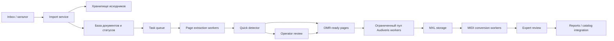

# Продуктовая архитектура и план масштабирования NoteVision OMR

Документ описывает переход от исследовательского MVP к библиотечной системе массовой обработки нотных документов. Фактические результаты текущего проекта отделены от расчётных оценок и предложений по будущей архитектуре.

## 1. Текущее состояние

NoteVision OMR реализован как воспроизводимый локальный pipeline:

```text
PDF/MRC
→ извлечение страниц
→ detector музыкальных страниц
→ ручная проверка labels
→ OMR-кандидаты
→ извлечение страниц в 300 DPI
→ Audiveris
→ MusicXML/MXL
→ music21
→ MIDI
```

Текущий корпус включает 41 документ и 2384 страницы. Реализованы:

- импорт и организация PDF/MRC по `doc_id`;
- извлечение страниц и библиографических метаданных;
- rule-based detector страниц с нотной записью;
- ручная проверка спорных страниц через локальную HTML-галерею;
- формирование OMR-кандидатов;
- пакетный запуск Audiveris;
- конвертация MXL в MIDI;
- CSV/JSON/HTML-отчёты и автоматические тесты.

На OMR-выборке из 150 страниц для 141 страницы были получены MXL и MIDI. Техническая успешность полного участка OMR–MIDI составила 94%. Этот показатель означает наличие читаемого выходного файла, но не доказывает музыкальную корректность распознанных нот.

Текущая реализация остаётся исследовательской: задачи запускаются CLI-командами, состояние хранится преимущественно в файлах, отсутствуют централизованная очередь, база операционных статусов, управление ролями и промышленный механизм возобновления обработки. Audiveris является внешним CPU-bound компонентом и формирует основное вычислительное ограничение.

## 2. Целевой пользовательский сценарий для библиотеки

Целевой сценарий должен минимизировать ручные операции и сохранять контроль человека на неоднозначных этапах.

1. Библиотека помещает PDF и MRC/MARC в `inbox` либо передаёт их через интерфейс загрузки.
2. Система определяет `doc_id`, связывает PDF с метаданными, проверяет дубликаты и создаёт запись документа.
3. Страницы извлекаются в разрешении, достаточном для быстрого анализа. Detector отделяет вероятные музыкальные страницы от текста, обложек, пустых и технических кадров.
4. Уверенные non-music страницы исключаются из дорогого OMR. Спорные страницы направляются оператору.
5. Оператор исправляет `page_type`, `has_music` и теги качества. После проверки страницы типов `music` и `mixed` получают статус готовности к OMR.
6. Система извлекает выбранные страницы в 300 DPI и ставит их в очередь Audiveris.
7. Ошибка отдельной страницы или документа фиксируется в отчёте и не останавливает остальные задания.
8. Музыкант или эксперт одновременно просматривает скан, отрисованный MusicXML и прослушивает MIDI. Он оценивает пригодность результата и отмечает музыкальные ошибки.
9. Система сохраняет версионированные MXL, MIDI, экспертные оценки, логи и сводные отчёты.
10. Разрешённые к использованию результаты передаются в библиотечный каталог или исследовательский контур.

Основные состояния страницы:

```text
imported
→ extracted
→ detected
→ review_required | omr_ready
→ omr_running
→ mxl_ready
→ midi_ready
→ expert_reviewed
```

Для любого этапа должен поддерживаться статус `failed` с причиной, числом попыток и возможностью повторного запуска.

## 3. Масштабирование на 87963 документа

Средний объём текущего корпуса составляет около 58 страниц на документ. Простая экстраполяция на 87963 документа даёт примерно 5,1 млн страниц. Это только оценка для проектирования: распределение объёма и доля нотных страниц во всём библиотечном фонде должны быть измерены на репрезентативной выборке.

| Риск | Проявление при масштабировании | Предлагаемая мера |
|---|---|---|
| Объём страниц | Миллионы файлов и длительная первичная обработка | Потоковая обработка, партии, приоритеты и хранение статусов |
| Время Audiveris | CPU-bound OMR становится основным ограничением | Ограниченный пул workers, очередь, benchmark производительности |
| Хранение | PNG могут потребовать единицы терабайт | Разделение временных и постоянных артефактов, сжатие и политика хранения |
| Повторные запуски | Повторное извлечение и OMR расходуют ресурсы | `skip-existing`, checksum, версия конфигурации и идемпотентные задачи |
| Локальные ошибки | Повреждённый PDF или сложная страница блокирует пакет | Изоляция заданий, retries и очередь окончательных ошибок |
| Неоднородность фонда | Старые сканы, фото, рукописи и нестандартная вёрстка | Теги качества, маршрутизация и отдельные тестовые группы |
| Каталожные данные | Неполные или неоднозначные MRC/MARC | Валидация схемы и сохранение исходной записи |
| Правовые ограничения | Не все производные MXL/MIDI можно публиковать | Уровни доступа и фиксация правового статуса документа |

Если средний PNG занимает от 200 КБ до 1 МБ, полный кэш 5,1 млн страниц потребует ориентировочно от 1 до 5 ТБ без учёта копий разных DPI, логов и OMR-результатов. Поэтому продукт не должен бессрочно хранить все промежуточные изображения без политики жизненного цикла.

Полное время OMR необходимо оценивать по измеренной производительности Audiveris:

```text
CPU-время = число выбранных OMR-страниц × среднее время одной страницы
```

Долю музыкальных страниц текущего специализированного корпуса нельзя напрямую переносить на весь фонд библиотеки. До расчёта инфраструктуры нужен пилот на случайной и стратифицированной выборках библиотечных документов.

## 4. Производительность

### 4.1. Предлагаемая схема



Файлы остаются контрактами для исследовательского экспорта, но операционные статусы следует хранить в базе данных. Очередь задач должна связывать обработку с конкретной версией исходника, detector, параметров DPI и OMR.

### 4.2. Механизмы ускорения и устойчивости

- **Skip-existing.** Пропускать этап, если артефакт существует, его checksum соответствует исходнику, а версия алгоритма и параметры не изменились.
- **Resume.** Возобновлять документ с последнего успешно завершённого этапа, а не запускать весь pipeline заново.
- **Task queue.** Представлять извлечение, detector, OMR и MIDI-конвертацию отдельными заданиями.
- **Batching.** Группировать лёгкие операции, но сохранять статус каждой страницы.
- **Workers.** Масштабировать независимые этапы отдельно. Число Audiveris workers ограничивать по CPU и памяти.
- **Контроль параллельности.** Не допускать конкуренции множества процессов Audiveris за одни и те же ядра и память.
- **Приоритеты.** Сначала обрабатывать запросы пользователей, проверенные страницы и пилотные коллекции, затем фоновый фонд.
- **Кэширование.** Хранить thumbnails и востребованные OMR-страницы; промежуточные файлы удалять или архивировать по политике хранения.
- **Quick detector.** До OMR выполнять дешёвый анализ страниц в 200 DPI или по уменьшенным копиям.
- **Выборочный OMR.** Запускать Audiveris только для подтверждённых `music`/`mixed` страниц с `has_music=1`.
- **Retries.** Повторять временные ошибки ограниченное число раз, после чего помещать задание в очередь ручного разбора.
- **Наблюдаемость.** Собирать время этапов, загрузку CPU, размеры файлов, доли ошибок и длину очереди.

Перед выбором оборудования необходимо провести benchmark: измерить среднее и перцентили времени Audiveris, потребление памяти и долю успешных страниц для разных типов сканов.

## 5. Web-интерфейс

В библиотечной версии web-интерфейс должен быть клиентом к API и очереди обработки, а не запускать тяжёлые процессы внутри пользовательского запроса.

### Основные модули

| Модуль | Назначение |
|---|---|
| Dashboard документов | Поиск, метаданные, прогресс, ошибки и итоговые артефакты |
| Очередь обработки | Приоритет, состояние workers, retries, pause/resume |
| Review страниц | Проверка detector, быстрые классы и теги качества |
| Экспертная проверка OMR | Сравнение скана, отрисованного MXL и MIDI |
| Просмотр результатов | Загрузка MXL/MIDI, версии и история обработки |
| Отчёты | Метрики detector, OMR, качества корпуса и производительности |
| Администрирование | Пользователи, роли, параметры pipeline и политики хранения |

### Роли

| Роль | Основные права |
|---|---|
| Оператор | Исправление типа страницы, статуса music и тегов качества |
| Музыкант/эксперт | Оценка музыкальной пригодности MXL/MIDI и комментарии об ошибках |
| Разработчик | Просмотр логов, повторный запуск, настройка версий компонентов |
| Администратор | Управление ролями, очередями, хранилищем и доступом к данным |

Для воспроизводимости нужны журнал изменений, автор и время каждой правки, версия исходника и возможность вернуть предыдущую экспертную оценку.

## 6. Интерфейс проверки музыкантом

Экран экспертной проверки целесообразно разделить на две синхронизированные области:

- слева — исходный скан с масштабированием и навигацией;
- справа — партитура, отрисованная из MusicXML/MXL;
- под партитурой — кнопка `Play MIDI`, остановка, выбор темпа и обычное piano/soundfont-воспроизведение;
- рядом — сведения о документе, странице, версии Audiveris и режиме конвертации;
- поля оценки `usable: yes / partial / no`;
- отдельные комментарии для pitch, duration, measure, voice, missing/extra notes и repeat;
- общий комментарий и отметка необходимости повторного OMR.

Полезны синхронная навигация по тактам, установка маркеров ошибок и быстрые горячие клавиши. Экспертная разметка должна сохраняться в базе и экспортироваться в CSV/JSON для статистического анализа ВКР.

Интерфейс обязан явно разделять:

- технический успех — MXL/MIDI создан и читается;
- частичную пригодность — файл открывается, но требует исправлений;
- музыкальную корректность — содержание подтверждено экспертом.

## 7. Обработка специальных случаев из ручной проверки

| Случай | Правило разметки | Дополнительное действие |
|---|---|---|
| Contents, index, оглавление | `page_type=text`, `has_music=0` | Тег `index` |
| Дубликат или повтор страницы | Сохранять фактический тип страницы | Флаг `duplicate_candidate`, ссылка на основную страницу, исключение повторного OMR |
| Подчёркнутая страница-указатель произведения | `page_type=text`, `has_music=0` | Тег `index` |
| Фото страницы или разворота | Тип определяется по содержанию | Тег `photo_scan`, обязательная проверка качества |
| Kodak/color control patch поверх нот | `page_type=bad_scan`, `has_music=0` | Тег `color_patch`, OMR не запускать автоматически |
| Цветная пустая или обложечная страница | `blank` либо `title` по смыслу, `has_music=0` | Сохранить цветовой thumbnail для проверки |
| Bleed-through/ghosting без реальной нотной записи | `page_type=blank`, `has_music=0` | Тег `bleed_through` |
| Рукописный текст | `page_type=text`, `has_music=0` | Тег `handwritten_text` |
| Рукописная нотация | `page_type=music`, `has_music=1` | Тег `handwritten_notation`, отдельная OMR-группа |
| Только номер страницы | `page_type=blank`, `has_music=0` | OMR не запускать |

Документы `rsl01010549152`, `rsl01013687437` и `rsl01013957967` следует сохранить как постоянный regression-набор сложных случаев. Их нельзя использовать только как отдельные анекдотические примеры: после полной ручной проверки нужно зафиксировать конкретные теги, ошибки detector и результаты OMR по каждой странице.

## 8. Нужно ли улучшать распознавание нот

| Направление | Роль | Решение |
|---|---|---|
| Audiveris | Воспроизводимый baseline и основной текущий OMR | Продолжать использовать и измерять качество |
| Oemer и другие open-source OMR | Альтернативный эксперимент | Сравнить на одной экспертно размеченной выборке |
| Собственный detector страниц | Дешёвый отбор кандидатов перед OMR | Улучшать на расширенной ручной разметке |
| Постобработка MXL | Исправление повторяющихся технических ошибок | Развивать после категоризации ошибок |
| Собственный full OMR | Распознавание символов и структуры | Не начинать без symbol-level ground truth и benchmark существующих решений |

Первый шаг — сравнительный benchmark на одинаковых страницах и единых метриках. Он должен учитывать не только факт создания MXL, но и pitch, duration, missing/extra notes, тактовую структуру, голоса и экспертную пригодность.

Разработка собственной full OMR-модели оправдана только в случае, если:

- существующие инструменты систематически не справляются с важными классами фонда;
- собран достаточный ground truth;
- ожидаемое улучшение соответствует стоимости разметки и разработки.

## 9. Предлагаемый следующий технический roadmap

### Ближайшие 1–2 недели

- добавить `skip-existing`, `resume` и явные статусы этапов;
- измерить время, CPU и память Audiveris на текущей выборке;
- уточнить причины девяти failures из OMR evaluation;
- завершить экспертную выборку MusicXML и протокол оценки;
- определить схему базы документов, страниц, задач и версий артефактов;
- формализовать теги специальных случаев;
- собрать простой прототип экрана scan–MXL–MIDI.

Результат этапа: измеренный baseline производительности и повторяемая обработка без лишнего пересчёта.

### Ближайшие 1–2 месяца

- внедрить очередь задач и ограниченный пул Audiveris workers;
- вынести операционные статусы из CSV в базу данных;
- реализовать dashboard, review detector и экспертную проверку OMR;
- добавить роли, журнал изменений и экспорт экспертных оценок;
- провести пилот на более крупной стратифицированной выборке;
- сравнить Audiveris с одним альтернативным OMR-подходом;
- определить политику хранения thumbnails, 300 DPI PNG, MXL и MIDI;
- настроить мониторинг времени, очередей и категорий ошибок.

Результат этапа: многопользовательский пилот, способный безопасно обрабатывать партии документов и возобновляться после ошибок.

### Долгосрочно

- организовать поэтапную обработку фонда из 87963 документов;
- масштабировать workers по результатам benchmark, не допуская неконтролируемой нагрузки;
- интегрировать статусы и разрешённые производные данные с библиотечным каталогом;
- добавить поиск по метаданным и музыкальному содержимому;
- исследовать поиск дублей, произведений и редакций;
- расширить экспертный ground truth до symbol- и measure-level;
- обучать собственные модели только для подтверждённых классов ошибок;
- формализовать правовой режим хранения и публикации производных MXL/MIDI.

## 10. Что является вкладом ВКР

Вклад ВКР следует формулировать как исследовательский и инженерный результат, а не как уже завершённое промышленное внедрение:

1. Сформирован и описан корпус исторических нотных документов с разметкой типов страниц и качества.
2. Разработана воспроизводимая методика подготовки PDF/MRC, отбора музыкальных страниц и формирования OMR-кандидатов.
3. Реализован и оценён detector музыкальных страниц, включая анализ ошибок и риска смещения из-за автоматически подтверждённых меток.
4. Проведена техническая оценка полного участка Audiveris–MXL–MIDI: 141 успешная страница из 150.
5. Подготовлена методика экспертной оценки музыкальной корректности MusicXML, отделённая от технического success rate.
6. Выявлены значимые для библиотечных фондов классы сложных страниц: mixed, рукописи, фото, color patches, старые сканы и нестандартная вёрстка.
7. Предложена архитектура масштабируемой библиотечной системы с очередью, возобновлением, контролируемым OMR, операторской и экспертной проверкой.

Архитектура для 87963 документов является проектным предложением. Её производительность, стоимость хранения и качество должны быть подтверждены отдельным пилотом и измерениями на репрезентативной части фонда.
